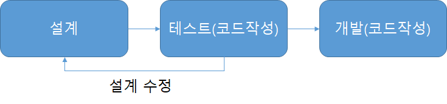

<details markdown="1">
<summary>출처</summary>

- [TDD란 뭘까? - https://m.blog.naver.com/PostView.nhn?blogId=suresofttech&logNo=221569611618&proxyReferer=https:%2F%2Fwww.google.com%2F](https://m.blog.naver.com/PostView.nhn?blogId=suresofttech&logNo=221569611618&proxyReferer=https:%2F%2Fwww.google.com%2F)🔗
- [TDD의 장단점 - https://dublin-java.tistory.com/54](https://dublin-java.tistory.com/54)🔗
- [TDD의 범위 - https://cho-coding.tistory.com/231](https://cho-coding.tistory.com/231)🔗
- [Javascript에서의 TDD예시 - https://cho-coding.tistory.com/231](https://cho-coding.tistory.com/231)🔗

</details>

# **About TDD**

TDD는 SEO와 마찬가지로 취준하면서 우대조건에서 많이 보이는 단어이다.    
도대체 요놈의 정체가 무엇이기에... 모두가 요놈을 원하는 걸까..  
이번 장에서는 TDD가 무엇이고 Javascript(내가 주로 사용하는..) 프로젝트에서   
사용되는 사례를 알아보자    
<br>

---
<br>
<details markdown="1">
<summary>목차</summary>

1. TDD란 뭘까?[🔗](#1.-TDD란-뭘까?)
2. TDD의 장단점[🔗](#2.-TDD의-장단점)
3. TDD의 범위[🔗](#3.-TDD의-범위)
4. Javascript에서의 TDD예시[🔗](#4.-Javascript에서의-TDD예시)
5. TDD 더 공부하기[🔗](#TDD-더-공부하기)

</details>
<br>

### **1. TDD란 뭘까?**


> 테스트 주도 개발(Test-driven development, TDD)은 매우 짧은 개발 사이클을 반복하는 소프트웨어 개발 프로세스 중 하나이다. 우선 개발자는 바라는 향상 또는 새로운 함수를 정의하는 (초기적 결함을 점검하는) 자동화된 테스트 케이스를 작성한다. 그런 후에, 그 케이스를 통과하기 위한 최소한의 양의 코드를 생성한다. 그리고 마지막으로 그 새 코드를 표준에 맞도록 리팩토링한다. 이 기법을 개발했거나 '재발견' 한 것으로 인정되는 Kent Beck은 2003년에 TDD가 단순한 설계를 장려하고 자신감을 불어넣어 준다고 말하였다.      
(출처 - 위키피디아)


- _기존 개발 프로세스_


- _TDD 개발 프로세스_




<br>

`그래 TDD가 각 개발단계마다 테스트케이스를 작성해서 그 테스트케이스를 통과하면`     
`다음 개발단계로 넘어가는 한마디로 '테스트를 염두에 둔 프로그램 개발'방법이란건 알겠어.`     
`그럼 테스트케이스를 왜 써야해? 굳이.. 그리고 어디서부터 어디까지 작성해야하고 어떻게 작성해야하는거지??`   

<br>

### **2. TDD의 장단점**

#### **2-1. 장점**

1. 오버엔지니어링 방지

    잘 정리된 요구사항의 역할도 하므로 딱 필요한 만큼만 코딩하도록 유도하여 불필요하게 복잡해지거나 오버 엔지니어링을 줄여준다.

2. 코드 커버리지 향상

    ```
    코드 커버리지란? 

    코드 커버리지(Code Coverage)는 소프트웨어의 테스트를 논할 때 얼마나 테스트가 충분한가를 나타내는 지표중 하나다.
    말 그대로 코드가 얼마나 커버되었는가이다. 소프트웨어 테스트를 진행했을 때 코드 자체가 얼마나 실행되었냐는 것이다.

    코드의 구조를 이루는 것은 크게 구문(Statement), 조건(Condition), 결정(Decision)이다.
    이러한 구조를 얼마나 커버했느냐에 따라 코드커버리지의 측정기준은 나뉘게 된다.
    일반적으로 많이 사용되는 커버리지는 구문(Statement)커버리지이며, 실행 코드라인이 한번 이상 실행 되면 충족된다.
    조건(Condition)커버리지는 각 내부 조건이 참 혹은 거짓을 가지면 충족된다.
    결정(Decision) 커버리지는 각 분기의 내부 조건자체가 아닌 이러한 조건으로 인해 전체 결과가 참 혹은 거짓이면 충족된다.
    ```

3. 집중력 향상

    모듈, 클래스, 메소드를 구체적으로 정의하도록 강제하여 일을 점진적으로 진행할 수 있다.   
    하나의 클래스, 메소드에 집중하지 못하고 관련된, 혹은 다른 여러 개를 동시에 작업하면서 흐름과 방향을 잃는 경우가 있다.   
    TDD를 하면 딱 하나에만 집중하게끔 강제하여 흐름을 잃지 않는다.

4. 설계에 대한 빠른 피드백

    객체지향 설계에에 있어서 객체 간의 의존 관계는 필요하다. 중요한 것은 이 의존도를 낮추는 거다. 설계 단계에서 잘한다면 좋겠지만,      
    잘못되었다면 언제 깨달을 수 있을까? 변경이 일어났을 때, 사용하기 어려울 때 깨달을 수 있다. 이러한 점에서 TDD는 설계에 대한 피드백을 빠르게 해준다.      

    예를 들면, 테스트 코드를 작성하는데 대상 코드가 잘못된 설계와 과도한 복잡도를 가지고 있으면 새로운 테스트 코드가 작성하기가 점점 어려워진다.

#### **2-2. 단점**

1. 개발시간의 증가

    테스트 코드를 아예 작성하지 않으면 개발시간이 상대적으로 늘어나겠지만   
    똑같이 테스트 코드를 작성한다면(개발한 후 테스트 코드 작성한 경우) 크게 달라지지 않을 것이다.

2. 진입장벽

    익숙지 않은 개발 방식의 어려움에 어떻게 해야 할지 감도 안 오고 스트레스를 받는다

<br>

## **3. TDD의 범위**

- 어디서부터 시작할 것인가?

    다음과 같은 두 날짜(YYYYMMDD)의 일 수 차이를 구하는 프로그램을 TDD로 작성해 보자.

    ```
    20070515 sub 20070501 = 14
    20070501 sub 20070515 = 14
    20070301 sub 20070515 = 31 + 30
    ```

    이 문제는 아주 쉬워 보이지만 만만하지는 않을 듯하다. 일단 가장 걸림돌이 될 만한 것은 윤달에 대한 것이다.    
    28일도 되었다가 29일도 되는 아주 특이한 것이므로. 잠시 생각해 본 결과 이 문제를 풀기 위한 가장 쉬운 해법은 다음과 같은 것이었다.

    결과 = 절대값(첫 번째 날짜의 총 일수 - 두 번째 날짜의 총 일수)

    해당 날짜의 1년부터 그 날짜의 지나온 총 일수를 구한다면 문제가 쉽게 해결될 듯하다.

    **TODO 리스트**

    1. 두 날짜(YYYYMMDD)의 차이일자를 구한다.
    2. 특정일자의 총 일수를 구한다.

    위처럼 TODO리스트에 테스트해야 할 것을 적는 것부터 시작하도록 하자. 만약 테스트가 통과 된다면 줄을 긋도록 하자.     
    조금 더 세분화 하여 특정일자의 총 일수를 구하기 위해서 다음의 세 가지 항목을 추가하였다.

    - 전년도까지의 총 일수를 구한다.
    - 전월까지의 총 일수를 구한다.
    - 해당일자까지의 총 일수를 구한다.

    즉, 20070515라는 날짜의 총 일수를 구하고 싶다면
    ```
    2007년 5월 15일의 총 일수 = 0년부터 2006년까지의 총 일수 + 2007년 1월부터 4월까지의 총 일수 + 15
    ```
    가 된다는 생각이다.

    **TDD Start!**

    다음과 같이 테스트해야 할 목록들을 가지게 되었고 테스트 코드를 작성할 준비가 되었다.
    목록에서 진행할 테스트의 순대로 코드를 작성한다.    
    (">"표시는 앞으로 진행 하려고 하는 테스트를 뜻한다.)

    - 두 날짜(YYYYMMDD)의 차이일자를 구한다.
        - 특정일자의 총 일 수를 구한다.
            - \>전년도까지의 총 일 수를 구한다.
            - 전달까지의 총 일 수를 구한다.
            - 해당일자까지의 총 일 수를 구한다.

<br>

## **4. Javascript에서의 TDD예시**

_리팩토링 작업 : 예외처리, 중복제거, 기능 추가 등_

<br>

**1. 테스트 도구 설치**

```javascript
npm install jest --save
or
yarn add jest 
// Jest : 페이스북에서 사용되는 리액트 애플리케이션을 포함한 모든 자바스크립트 테스트 도구
```
<br>

**2. 테스트 코드 작성**

```javascript
./sum.test.js

const sum = require('./sum');

test('1 + 2 = 3', () => {
    expect(sum(1, 2)).toBe(3);
})

it('calculates 1 + 2', () => {
    expect(sum(1, 2)).toBe(3);
})
```

`test( ) : 새로운 테스트 케이스를 만드는 함수`      
`it( ) : test( )와 똑같지만, 케이스 설명을 영어로 작성하게 되는 경우, "말이 되게" 작성 할 수 있음`      
`expect( ) : 특정 값을 예상하여 사전에 정의하고, 통과하면 성공시키고 통과하지 않으면 테스트를 실패시킴`     
`toBe(정한 값) : 특정 값이 내가 정한 값과 일치하는지 확인 해줌`     
<br>

**3. 테스트할 코드 작성**

```javascript
./sum.js

function sum(a, b) {
    return a - b; // 실패 코드
    return a + b; // 성공 코드
}

module.exports = sum;
```
<br>

**4. scripts 작성**

```javascript
{
  "name": "0902",
  "version": "1.0.0",
  "description": "",
  "main": "sum.js",
  "scripts": {
    "test": "jest --watchAll --verbose"
  },
  "author": "",
  "license": "ISC",
  "dependencies": {
    "jest": "^24.9.0"
  }
}
```

**5. 실행**

```javascript
npm test
or
yarn test
```

- 성공했을 경우😊


- 실패 했을 경우😥


<br>

### **➕기능 추가**

**1. 추가 테스트 코드 작성**

```javascript
./sum.test.js

const { sum, sumOf } = require('./sum');

describe('sum', () => {
    it('calculates 1 + 2', () => {
        expect(sum(1, 2)).toBe(3);
    });

    it('calculates all numbers', () => {
        const array = [1, 2, 3, 4, 5];
        expect(sumOf(array)).toBe(15);
    })
})
```
`describe( ) : 여러 테스트 케이스를 묶어서 사용 가능`
<br>

**2. 테스트할 코드 추가 작성**

```javascript
./sum.js

function sum(a, b) {
    return a + b;
}

function sumOf(numbers){
    let result = 0;
    numbers.forEach(n => {
        result += n;
    });
    return result;
}

// 내보내기
// module.exports = sum; 

// 각각 내보내기
exports.sum = sum;
exports.sumOf = sumOf;
 ```
 <br>

### **🛠리팩토링**

- 리팩토링 이후 코드가 제대로 작동하고 있는 것을 검증하기 매우 간편함

```javascript
./sum.js

function sum(a, b) {
    return a + b;
}

function sumOf(numbers){
    // let result = 0;
    // numbers.forEach(n => {
    //     result += n;
    // });
    // return result;
    
    // 리팩토링
    return numbers.reduce((acc, cur) => acc + cur, 0);
}

// 내보내기
// module.exports = sum; 

// 각각 내보내기
exports.sum = sum;
exports.sumOf = sumOf;
```
<br>

## **TDD 더 공부하기**
- [TDD는 설계 방법론이 아니다-이규원님 포스트](https://gyuwon.github.io/blog/2019/03/03/tdd-is-not-a-design-methodology.html?fbclid=IwAR0mQn64MyvSHErsztAvIi1EKEXi9bZYn-OsCPsSC5U7J0GiUQBXC2tqi9o)
- [[번역] TDD 변절자: TDD는 설계 기법이 아니다.- Rachel님 포스트](https://medium.com/@mjspring/%EB%B2%88%EC%97%AD-tdd-%EB%B3%80%EC%A0%88%EC%9E%90-tdd%EB%8A%94-%EC%84%A4%EA%B3%84-%EA%B8%B0%EB%B2%95%EC%9D%B4-%EC%95%84%EB%8B%88%EB%8B%A4-2519b05474d0)
